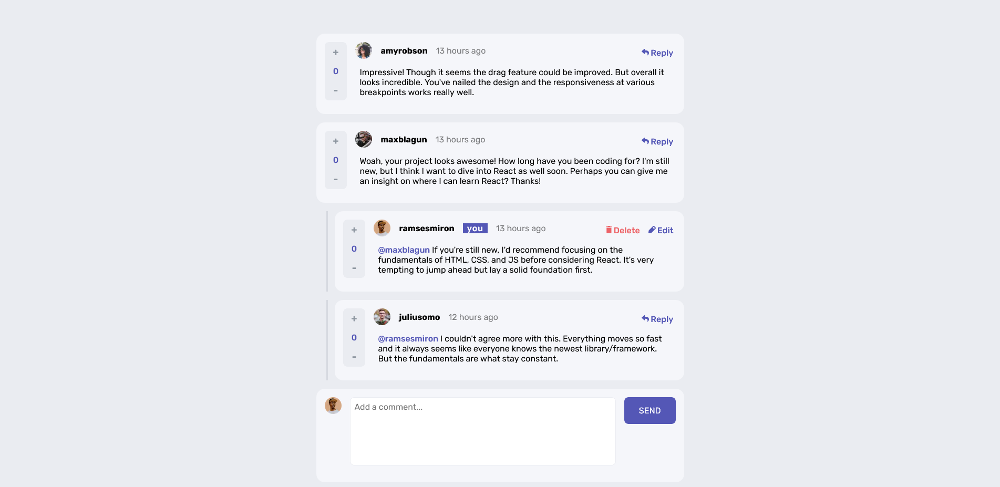

# Interactive comments section

[Link to deployed project](https://comments-section-hazel.vercel.app/)
[Link to backend repo](https://github.com/ms097530/messages-backend)
---

## Overview
This project was built using Next.js as a frontend and with a Node Express server on the backend. The design and images were provided by [Frontend Mentor](https://www.frontendmentor.io/challenges/interactive-comments-section-iG1RugEG9/hub/interactive-comments-section-x1rvnW_CsS).

Rather than implementing sign-in, I prepopulated a collection in a MongoDB database with the 4 users that were given in the project. Upon entering the website, one of the "users" is randomly assigned to the actual user. Certain parts of the interface are conditionally rendered depending on what user you are "logged in as". Socket.io is used to send data back and forth so that the UI can be updated in sync with updates in the database.

Built with:
- [Next.js](https://nextjs.org/) - React framework
- NodeJS
- Express
- Mobile-first workflow
- CSS modules
- Socket.io

## Author

- Website - [Michael Schultz](https://mschultz-portfolio.herokuapp.com/)
- Frontend Mentor - [@ms097530](https://www.frontendmentor.io/profile/ms097530)
